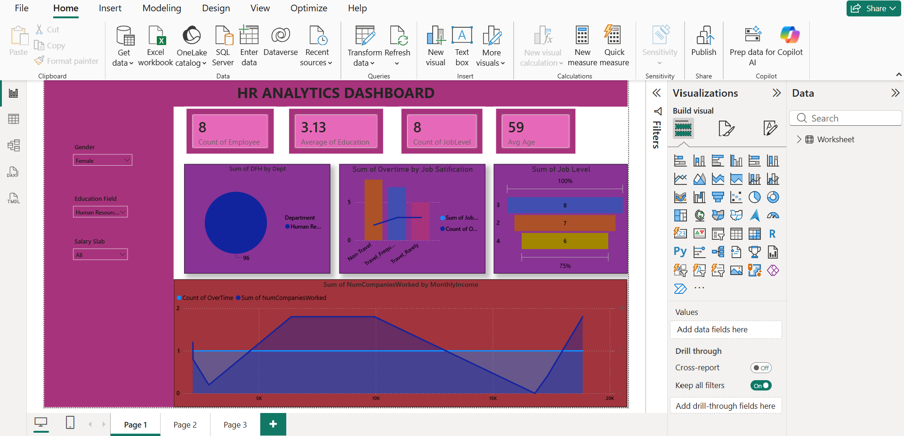
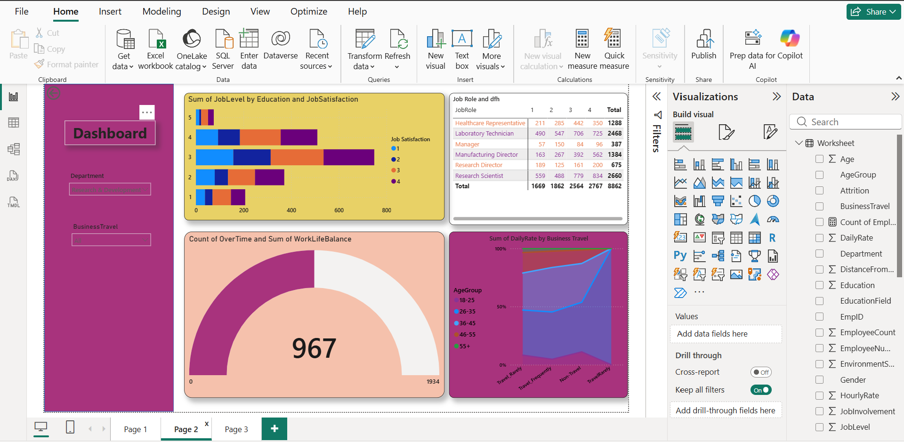
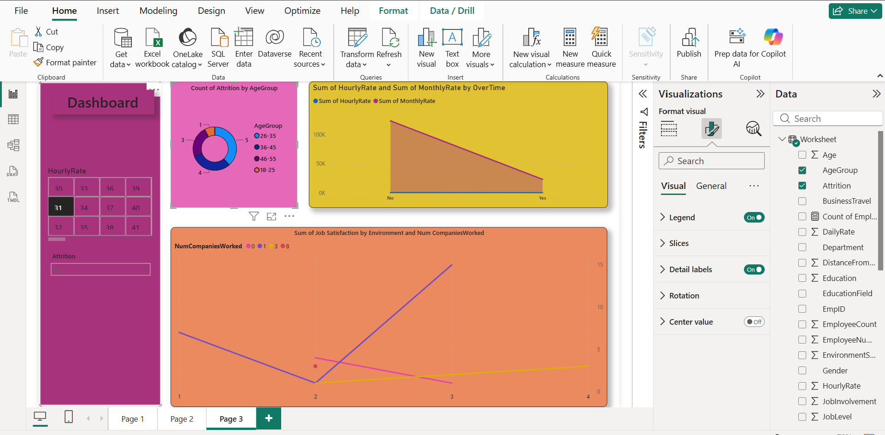

# 👥 HR Analytics Dashboard (Power BI)

## 📌 Project Overview
An interactive HR Analytics Power BI dashboard designed to track employee demographics, job satisfaction, work-life balance, overtime trends, and attrition patterns across different departments and roles.

---

## 📊 Dashboard Views

### 1. HR Overview & Demographics

### 2. Job Satisfaction & Work-Life Balance

### 3. Employee Attrition & Compensation Analysis

---

## 🔑 Key Metrics & Business Insights Tracked
- **Workforce Metrics:** Monitored total employee count, average age, education levels, and job hierarchy levels.
- **Overtime & Satisfaction:** Evaluated the correlation between overtime hours, travel frequency, and job satisfaction scores.
- **Work-Life Balance Breakdown:** Analyzed employee work-life balance ratings across various job roles and departments.
- **Attrition Analysis:** Identified attrition rates across age groups, hourly compensation rates, and previous company tenures.

---

## 🛠️ Tools & Technologies Used
- **Power BI Desktop:** Multi-page report layout, gauge charts, stacked charts, and custom slicers
- **Power Query:** Data cleaning, ETL pipelines, handling missing values, and data type formatting
- **DAX Measures:** Custom metrics for employee counts, averages, and attrition percentages
- **Dataset:** HR Employee Records Data (CSV/Excel)

---

## 📂 Repository Contents
- `hr.project.pbix` : Power BI Project Workbook
- HR Dataset File (CSV/Excel)
- Dashboard Visuals: `hr_overview.png`, `hr_job_satisfaction.png`, `hr_attrition_analysis.png`
